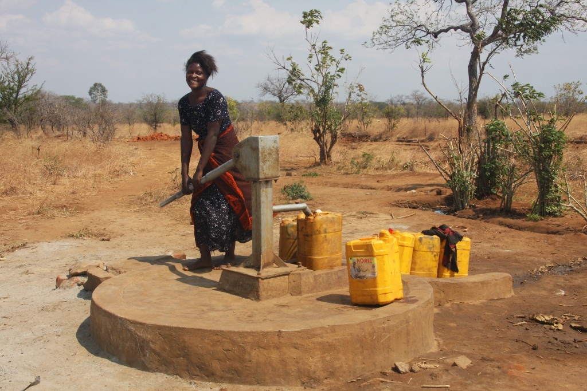
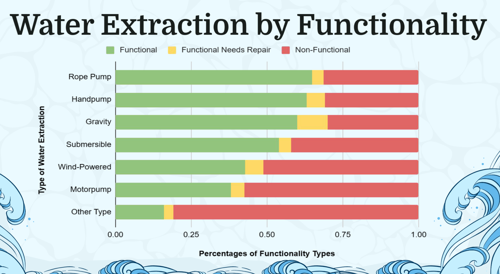

# Tanzanian Water Wells
**Testing conditions of water wells in Tanzania to determine the safety of the wells drinking water**

## Overview
This project aims to assess the conditions of water wells in Tanzania to determine the safety of the drinking water they provide. The main approach is to analyze relevant data and build a predictive logistic regression model to identify whether a water well is functioning well or not. 
By understanding the contributing features to the functionality of the wells, this project can assist in ensuring access to clean and safe drinking water for communities in Tanzania. This is also so Tanzania’s Ministry of Water can utilize their resources to repair and maintain the water wells that have the highest likelihood of being in need of repair.

**This is an important project because Tanzania is in the midst of a water crisis:**
4 million people in the country do not have access to a source of safe drinking water and 30 million people lack access to improved water sanitation. 
A better understanding of which features might be contributing to water pumps functionality could possibly help ensure that clean water becomes available to more people across the country.

## Table of Contents
Background
Data
Methodology
Model Results
Analysis
Data Visuals
Future Reccomendations
Next Steps

## Background
Access to clean and safe drinking water is crucial for the well-being and health of any community. In Tanzania, many communities rely on water wells as their primary source of drinking water. However, the functionality and safety of these wells can vary, and it is essential to identify which wells are functioning well and providing safe water.

**This project aims to address the following questions:**

- How can we determine if a water well in Tanzania is functioning well or not?

- What features and factors contribute to the functionality and safety of water wells in Tanzania?

- Can we build a predictive model to assess the safety of a water well based on available data?

## Data
The project utilizes a dataset that includes information about various water wells in Tanzania. 

This data set is derived from drivendata.org, and the data in the dataset contains information from Taarifa and the Tanzanian Ministry of Water.

**This data set contains over 59,000 data points and several features, including but not limited to:**

- Geographical location (latitude and longitude) of the wells.

- Water quality parameters (e.g., pH, turbidity, presence of contaminants).

- Well construction details (e.g., depth, type, and age of the well).

- Pump functionality information (whether the pump is operational or not).

- Groundwater level and rainfall patterns.

The dataset is available in the data directory of this project.

## Methodology
The project follows these main steps:

**Data Preprocessing:** Cleaning and preparing the dataset for analysis, handling missing values, and encoding categorical variables.

**Exploratory Data Analysis (EDA):** Visualizing the data to gain insights into the distribution of features, relationships between variables, and identifying potential patterns or trends.

**Feature Selection:** Identifying the most relevant features that contribute significantly to the functionality and safety of the water wells.

**Model Building:** Using logistic regression, a predictive model will be trained using the selected features to predict the functionality of water wells as a binary outcome (functioning well or not).

**Model Evaluation:** Assessing the performance of the logistic regression model using appropriate evaluation metrics (e.g., accuracy, precision).

**Interpretation:** Interpreting the model results to understand the factors that most influence the functionality and safety of water wells.

## Model Results
The final model has a 72% accuracy score and 61% precision rate.

Because the model will be determining where to pool together resources, accuracy and precision play very important parts when using these models predictions.

## Analysis
With the final model I wanted to take a look at what features played the biggest part to help guide the direction of future recommendations.

We can see that the top three most important features in the model are: 

- The Water Point which contibutes 0.12 
- The Source of Water which contibutes 0.10
- The Type of Water Extraction which contibutes 0.09

Feature (variable) importance indicates how much each feature contributes to the model prediction. Basically, it determines the degree of usefulness of a specific variable for a current model and prediction.

## Data Visuals
**Water Extraction by Functionality**

This graph shows the functionality percentages of all the different types of water extraction devices.

A Water Extraction device means how the water is extracted from the ground.

As we can see a Rope pump has the highest percentage of functioning water wells and the unknown/other types of water extraction devices have the highest percentage of non-functional water wells

**Water Source by Functionality**

This graph shows the functionality percentages of all the different types of water sources.

A Water source is a body of water for public drinking, like surface water or recycled water.

As we can see the spring water source has the highest percentage of functioning water wells and the dam water sources have the highest percentage of non-functional water wells

**Water points by Functionality**

This graph shows the functionality percentages of all the different types of water points.

A water point is an artificial body of water that is usually meant to supply drinking water for wildlife.

As we can see the Dam water point has the highest percentage of functioning water wells and the other/unknown water points have the highest percentage of non-functional water wells

## Future Recommendations 
The first recommendation moving forward is to focus on building the water well pumps that have the lowest non-functionality percentages, like a Rope Pump or a Hand Pump.

The second recommendation is to focus maintenance resources on extraction types that have the highest percentage of failing and need repair like the motor pump or a ‘other’ type of water extraction device.

The third recommendation is to avoid uncommon or other water-points and extraction devices as they have the highest percentage of non-functional water wells.

## Next steps
The next steps moving forward with this project should be to:

- Focus on the different regions in Tanzania and how water quality differs region to region.

- Gather geographical information about where the water sources are extracted from as geography plays a role in what state the quality of the water will be.

- Explore types of water pumps in specific regions and how good the water quality is, with geographical insights.

